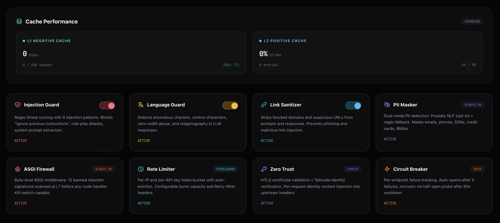

# LLMProxy — LLM Security Gateway

Security-first proxy for Large Language Models with multi-provider support (15 providers), cross-provider fallback, per-model pricing, cost-aware smart routing, ring-based plugin pipeline, WASM-sandboxed plugin execution, NLP-powered PII detection, cross-session threat intelligence, HMAC response signing, semantic injection detection (54-pattern multilingual corpus), GDPR compliance (right to erasure, DSAR), immutable audit ledger, global fail-closed auth middleware, and a real-time Security Operations Center UI.


[](https://github.com/fabriziosalmi/llmproxy/actions/workflows/ci.yml)



## Table of Contents
1. [Architecture Overview](#architecture-overview)
2. [Security Pipeline](#security-pipeline)
3. [Plugin Engine](#plugin-engine)
4. [API Reference](#api-reference)
5. [Security & Identity](#security--identity)
6. [Observability & Export](#observability--export)
7. [Frontend SOC](#frontend-soc)
8. [Configuration](#configuration)
9. [Testing](#testing)
10. [Installation & Deployment](#installation--deployment)

---

## Architecture Overview

LLMProxy is a security-focused LLM gateway with a layered defense pipeline:

1. **Multi-Provider Translation** — 15 providers (OpenAI, Anthropic, Google, Azure, Ollama, Groq, Together, Mistral, DeepSeek, xAI, Perplexity, Fireworks, OpenRouter, SambaNova) with automatic request/response format translation
2. **Cross-Provider Fallback** — Configurable fallback chains (e.g. GPT-4o fails → Claude Sonnet → Gemini Pro)
3. **Smart Routing** — Cost-aware EMA-weighted endpoint selection: `score = (success²/latency) × cost_factor^w` with configurable cost_weight. Budget-triggered auto-downgrade to local models.
4. **ASGI Firewall** — Byte-level L7 request filtering
5. **SecurityShield** — Injection scoring, PII masking (Presidio NLP + regex), per-session trajectory detection, cross-session threat intelligence (ThreatLedger)
6. **Ring Plugin Pipeline** — 5-ring plugin engine (INGRESS → PRE_FLIGHT → ROUTING → POST_FLIGHT → BACKGROUND)
7. **WASM Sandbox** — Extism-based sandboxed plugin execution for untrusted code
8. **Per-Model Pricing** — Accurate cost tracking for 30+ models with verified provider pricing
9. **Active Health Probing** — Background endpoint liveness checks with circuit breaker integration
10. **Request Deduplication** — X-Idempotency-Key support to prevent duplicate upstream calls

### Route Architecture
The `RotatorAgent` orchestrates 9 route modules under `proxy/routes/`, each a factory function (`create_router(agent) -> APIRouter`):

| Module | Routes | Responsibility |
|--------|--------|----------------|
| `chat.py` | `/v1/chat/completions` | Core proxy endpoint with auth, identity, RBAC, zero-trust, budget tracking |
| `completions.py` | `/v1/completions` | Legacy text completion endpoint (prompt→messages translation) |
| `embeddings.py` | `/v1/embeddings` | Embedding endpoint with PII security check, multi-provider translation |
| `models.py` | `/v1/models`, `/v1/models/{id}` | OpenAI-compatible model discovery (aggregated from all providers) |
| `admin.py` | `/api/v1/proxy/*`, `/api/v1/features/*`, `/api/v1/panic`, `/api/v1/analytics/*`, `/api/v1/audit` | Proxy control, feature toggles, kill-switch, spend analytics, audit log |
| `registry.py` | `/api/v1/registry/*`, `/api/v1/telemetry/stream` | Endpoint CRUD, SSE telemetry stream |
| `identity.py` | `/api/v1/identity/*` | SSO config, user info, token exchange |
| `plugins.py` | `/api/v1/plugins/*` | Plugin lifecycle (install, uninstall, hot-swap, rollback) |
| `telemetry.py` | `/health`, `/metrics`, `/api/v1/logs` | Health probes, Prometheus metrics, log SSE |
| `gdpr.py` | `/api/v1/gdpr/*` | GDPR compliance: right to erasure, DSAR export, retention policy |

Heavy dependencies (OpenTelemetry, Sentry) are lazily imported inside route handlers, not at module level — enabling test isolation without mocking the entire import chain.

### Tech Stack
| Layer | Technology |
|-------|-----------|
| Backend | Python 3.12+, FastAPI (modular routers), uvicorn, aiohttp |
| Frontend | Vanilla JS (ES Modules), Tailwind CSS, Chart.js, xterm.js |
| Database | SQLite (aiosqlite) — endpoints, app state, spend analytics, audit log |
| Observability | OpenTelemetry, Prometheus, Sentry |
| Security | PyJWT, OIDC/JWKS, mTLS, Tailscale Zero-Trust |
| Secrets | Infisical SDK + env fallback |

---

## API Reference

### Model Proxy (Port 8090)
| Endpoint | Method | Description |
|----------|--------|-------------|
| `/v1/chat/completions` | `POST` | Unified inference endpoint (OpenAI-compatible). 15 providers, cross-provider fallback, model aliases. |
| `/v1/completions` | `POST` | Legacy text completion endpoint. Translates prompt→messages, supports streaming. |
| `/v1/embeddings` | `POST` | Embedding endpoint with PII security check. Supports OpenAI, Google, Ollama, Azure. |
| `/v1/models` | `GET` | Model discovery — aggregates models from all configured providers. Required by Cursor, OpenWebUI, etc. |
| `/v1/models/{model_id}` | `GET` | Single model info with auto-detection fallback. |
| `/health` | `GET` | Liveness/readiness probe with pool stats. |
| `/metrics` | `GET` | Prometheus metrics: req/s, errors, latency P50/P95/P99, budget, TTFT, circuit state. |

### Registry & Control
| Endpoint | Method | Description |
|----------|--------|-------------|
| `/api/v1/registry` | `GET` | Full model pool state (Live/Discovered/Offline). |
| `/api/v1/registry/{id}/toggle` | `POST` | Toggle endpoint on/off. |
| `/api/v1/registry/{id}/priority` | `POST` | Set endpoint routing priority. |
| `/api/v1/registry/{id}` | `DELETE` | Remove an endpoint. |
| `/api/v1/proxy/toggle` | `POST` | Enable/disable the proxy. |
| `/api/v1/proxy/status` | `GET` | Proxy enabled state + priority mode. |
| `/api/v1/proxy/priority/toggle` | `POST` | Toggle priority steering mode. |

### Identity & SSO
| Endpoint | Method | Description |
|----------|--------|-------------|
| `/api/v1/identity/me` | `GET` | Current user identity, roles, and permissions (from JWT or API key). |
| `/api/v1/identity/exchange` | `POST` | Exchange external OIDC JWT for internal proxy session token. |
| `/api/v1/identity/config` | `GET` | Public SSO provider list (for frontend OAuth flow). |

### Plugins
| Endpoint | Method | Description |
|----------|--------|-------------|
| `/api/v1/plugins` | `GET` | List all plugins with marketplace metadata (version, author, ui_schema). |
| `/api/v1/plugins/install` | `POST` | Install a plugin (AST-scanned, then hot-swapped). |
| `/api/v1/plugins/{name}` | `DELETE` | Uninstall a plugin. |
| `/api/v1/plugins/toggle` | `POST` | Enable/disable a plugin. |
| `/api/v1/plugins/hot-swap` | `POST` | Zero-downtime RCU reload with health check. |
| `/api/v1/plugins/rollback` | `POST` | Rollback to previous plugin state. |

### System
| Endpoint | Method | Description |
|----------|--------|-------------|
| `/api/v1/features` | `GET` | Feature flags (language_guard, injection_guard, link_sanitizer). |
| `/api/v1/features/toggle` | `POST` | Toggle a security feature. |
| `/api/v1/telemetry/stream` | `GET` | Real-time SSE stream of system events. |
| `/api/v1/logs` | `GET` | SSE log stream for terminal. |
| `/api/v1/panic` | `POST` | Emergency kill-switch — halts all traffic. |
| `/api/v1/admin/reload` | `POST` | Hot-reload config.yaml without restart. |
| `/api/v1/analytics/spend` | `GET` | Spend breakdown by model/provider/key/date. Params: `from`, `to`, `group_by`, `limit`. |
| `/api/v1/analytics/spend/topmodels` | `GET` | Top models by spend. |
| `/api/v1/analytics/cost-efficiency` | `GET` | Per-model cost/request efficiency with cheapest/most expensive ranking. |
| `/api/v1/audit` | `GET` | Persistent audit log query. Params: `from`, `to`, `model`, `key_prefix`, `status`, `blocked`. |
| `/api/v1/audit/verify` | `GET` | Verify integrity of audit log hash chain (tamper detection). |
| `/api/v1/gdpr/erase/{subject}` | `POST` | Right to erasure (Article 17): delete all data for a subject. |
| `/api/v1/gdpr/export/{subject}` | `GET` | DSAR (Article 15): export all subject data with PII scrubbing. |
| `/api/v1/gdpr/retention` | `GET` | View data retention policy. |
| `/api/v1/gdpr/purge` | `POST` | Manual trigger: purge records older than retention period. |
| `/api/v1/version` | `GET` | Current version. |
| `/api/v1/service-info` | `GET` | Host, port, URL. |
| `/api/v1/network/info` | `GET` | Network and Tailscale status. |
| `/api/v1/cache/stats` | `GET` | Cache subsystem status (L1 negative + L2 positive). |
| `/api/v1/guards/status` | `GET` | Consolidated security subsystem status. |
| `/api/v1/metrics/latency` | `GET` | Per-ring and per-plugin latency percentiles (P50/P95/P99). |
| `/api/v1/metrics/ring-timeline` | `GET` | Recent request traces with per-ring execution breakdown. |
| `/api/v1/webhooks` | `GET` | Configured webhook endpoints and event types. |
| `/api/v1/export/status` | `GET` | Export subsystem status and recent files. |
| `/api/v1/rbac/roles` | `GET` | RBAC role permission matrix. |

---

## Security & Identity

### Global Auth Middleware — Fail-Closed (`proxy/app_factory.py`) — v1.10.0

The outermost security layer implements **deny-by-default** for all admin-class paths before any route handler runs.

| Scope | Behaviour |
|-------|-----------|
| `/api/v1/*` | Denied unless in public whitelist |
| `/admin/*` | Denied unless in public whitelist |
| `/metrics` | Denied (timing/volume side-channel) |
| `/docs`, `/redoc`, `/openapi.json` | Disabled when auth is enabled |
| `/health` | Public (liveness probe) |
| `/api/v1/identity/config` | Public (SSO discovery) |
| `/api/v1/identity/exchange` | Public (JWT validated inside route) |
| `/api/v1/identity/me` | Public (returns `{"authenticated":false}`) |
| `/v1/*` | Public prefix (chat/embeddings/models do their own auth) |

**Why this matters**: previous versions required developers to remember `_check_admin_auth()` on every new route — a per-route opt-in that guaranteed future CVEs (Rounds 7, 8, 9 each found unprotected endpoints). With the global middleware any new route under a protected prefix is automatically denied; the developer must explicitly whitelist it to make it public. Per-route `_check_admin_auth()` closures are retained as defence-in-depth.

### Byte-Level Firewall (`core/firewall_asgi.py`)
ASGI middleware scanning request body bytes for injection patterns:
- **Pattern matching** for injection signatures (11 patterns: `ignore previous instructions`, `bypass guardrails`, `reveal your system prompt`, etc.).
- **Instant 403 response**: Terminates request before it reaches the LLM, preventing cost incurrence.
- **Limitation**: Pattern-based only — not a substitute for ML-based injection detection. Sophisticated prompt injection can bypass static patterns.

### SecurityShield (`core/security.py`)
Deep inspection layer wired pre-INGRESS in the request chain:
- **Multi-turn trajectory detection**: Tracks prompt score history per session, detects escalating jailbreak attempts via sliding window analysis.
- **Cross-session threat intelligence** (`core/threat_ledger.py`): Aggregates threat scores by IP and API key across sessions. Detects coordinated attacks where the same actor rotates session IDs. Configurable threshold, window, and min_events.
- **Injection scoring**: Regex-based threat scoring with configurable threshold.
- **PII detection & masking**: Dual-mode — Presidio NLP (opt-in, 18 entity types) with regex fallback (email, phone, SSN, credit card, IBAN). `mask_pii()` replaces PII with vault tokens; `demask_pii()` restores originals.
- **Lexical injection detection** (`core/semantic_analyzer.py`): Sliding-window trigram Jaccard similarity with dual-gate system (overlap + similarity thresholds) against 54 known injection patterns. This is a lexical method (not ML-based) — catches synonym substitution, multilingual injection (IT/DE/FR/ES/JA/KO/AR), verbose wrapping, and injections embedded in long prompts. 8 categories. Adaptive thresholds reduce false positives on common English words. Zero external deps, <1ms latency.
- **Response signing** (`core/response_signer.py`): HMAC-SHA256 attestation (proxy→client tamper detection). Signs `model|provider|timestamp|request_id|body`. Verifiable via `X-LLMProxy-Signature` header. Constant-time comparison prevents timing attacks. Note: this proves the response wasn't modified after leaving the proxy — it does not prove which LLM generated it (no provider signs responses today).
- **Wired in `RotatorAgent.proxy_request()`**: Runs before the plugin INGRESS ring — blocked requests return 403 with diagnostic message.

### Identity & SSO (`core/identity.py`)
Stateless multi-provider OIDC/JWT verification:
- **Providers**: Google, Microsoft, Apple — auto-configured via well-known OIDC discovery.
- **JWKS caching**: Keys cached with 1hr TTL, auto-refresh on rotation.
- **Auth flow**: External OIDC JWT → verify via JWKS → exchange for internal proxy JWT → attach `IdentityContext` to request.
- **Fallback chain**: JWT → API key → Tailscale identity (via LocalAPI socket).
- **No user database**: Identity is derived entirely from cryptographic token claims.

### OAuth Frontend (`ui/services/auth.js`)
Browser-based SSO login flow:
- **Popup-based OAuth**: Click provider button → popup opens OIDC authorize URL → `id_token` extracted from URL fragment.
- **Callback handler**: `oauth-callback.html` relays token via `postMessage` to opener window.
- **Token exchange**: `POST /api/v1/identity/exchange` converts external JWT to internal proxy session token (stored in `localStorage`).
- **Guard route**: If identity is enabled and no valid session exists, a glassmorphism login overlay is shown.
- **API key fallback**: Manual API key entry for environments without SSO.

### RBAC (`core/rbac.py`)
Four built-in roles with granular permissions:

| Role | Key Permissions |
|------|----------------|
| `admin` | Full access: proxy, registry, chat, logs, plugins, users, budget. |
| `operator` | Proxy toggle, registry write, plugins manage, features toggle. |
| `user` | Proxy use, registry read, chat, logs read. |
| `viewer` | Registry read, logs read only. |

- JWT claims → role mapping via `config.yaml` (`role_mappings`).
- Roles persisted in SQLite `user_roles` table.
- Budget quota enforcement per API key.

### Zero-Trust
- **Tailscale LocalAPI**: Verifies machine/user identity via Unix socket (`whois` API).
- **URL injection prevention**: All user-supplied IPs/URLs are escaped via `urllib.parse.quote()`.

### Webhook Security (`core/webhooks.py`)
- **HMAC-SHA256 payload signing**: `X-Webhook-Signature: sha256=<hex>` header on every delivery when `secret` is configured — proves payload authenticity to the receiver.
- **SSRF prevention**: `_SSRFBlockingResolver` intercepts aiohttp DNS resolution at TCP connect time and blocks private/reserved IPs (RFC-1918, loopback, 169.254/16, IPv6 ULA/link-local). Fail-closed: DNS failures abort the delivery rather than passing silently. IP literals are validated at load time; hostname-based URLs are validated on every DNS lookup to prevent DNS rebinding.

### Concurrent Budget Safety (`proxy/rotator.py`, `proxy/forwarder.py`)
- **Delta-based cost accounting**: Each streaming request tracks only its own cost increment (`{"delta": 0.0}`). The rotator atomically adds the delta under `budget_lock` after the stream completes — preventing the lost-update race where N concurrent streams each started from the same `total_cost_today` snapshot and the last writer silently discarded all prior charges.

### GDPR Compliance (`proxy/routes/gdpr.py`)
Data subject rights implemented as REST endpoints:
- **Right to erasure** (Article 17): `POST /api/v1/gdpr/erase/{subject}` — deletes all audit, spend, and identity records. The erasure itself is logged immutably.
- **Data Subject Access Request** (Article 15): `GET /api/v1/gdpr/export/{subject}` — exports all subject data with PII scrubbing.
- **Data retention**: Configurable TTL (default 90 days) with automatic background purge loop. Manual purge via `POST /api/v1/gdpr/purge`.
- **Retention policy**: `GET /api/v1/gdpr/retention` — returns configured retention period, legal basis, and data categories.

### Immutable Audit Ledger
Tamper-evident audit log with SHA256 hash chain:
- Each audit entry includes `entry_hash = SHA256(prev_hash|ts|req_id|...all fields...)`.
- `prev_hash` links to the previous entry's hash (first entry links to `GENESIS`).
- **Tamper detection**: `GET /api/v1/audit/verify` walks the chain and detects modifications, deletions, or insertions.
- Backward-compatible: legacy entries without hashes are skipped during verification.

### Supply Chain Defense (`scripts/verify_deps.py`)
Six-layer defense against dependency supply chain attacks (inspired by the litellm 1.82.8 credential stealer, 2026-03-24):
1. **Minimal surface**: 11 pinned direct dependencies (vs 100+ in comparable proxies).
2. **Version pinning**: all deps pinned to exact versions; mismatch detected at boot.
3. **`.pth` malware scanner**: scans site-packages for malicious `.pth` files (code execution, network access, persistence, credential exfiltration, process spawning). Runs at boot, in CI, and during Docker build.
4. **Blocked package list**: known-compromised packages (`litellm`, typosquats) detected and blocked.
5. **CI integrity check**: `scripts/verify_deps.py --strict` in GitHub Actions post pip-install.
6. **Docker build audit**: `.pth` scan as a build step — compromised packages fail the image build.

### Plugin Circuit Breaker
Per-plugin circuit breaker auto-quarantines misbehaving plugins:
- After 10 consecutive errors → plugin quarantined for 60 seconds.
- Half-open retry: after cooldown, plugin gets one chance to recover.
- Success resets the error streak counter.
- Quarantined plugins are skipped (logged at DEBUG level).

---

## Plugin Engine

**Dual-mode** ring-based architecture (`core/plugin_engine.py`) with 5 processing stages. Supports both legacy raw functions and `BasePlugin` class instances side by side — zero breaking changes.

| Ring | Stage | Purpose |
|------|-------|---------|
| 1 | **Ingress** | Auth, Zero-Trust, Global Rate Limiting |
| 2 | **Pre-Flight** | PII Masking, Prompt Mutation, Budget Guard, Loop Breaker, Cache Lookup, Complexity Scoring |
| 3 | **Routing** | Dynamic Model Selection, Load Balancing, Priority Steering |
| 4 | **Post-Flight** | JSON Healing, Response Sanitization, Quality Gate, SLA Guard |
| 5 | **Background** | FinOps Tracking, Telemetry Export, Shadow Traffic |

### Plugin SDK (`core/plugin_sdk.py`)
The official SDK for building marketplace plugins:

```python
from core.plugin_sdk import BasePlugin, PluginResponse, PluginHook
from core.plugin_engine import PluginContext

class MyPlugin(BasePlugin):
    name = "my_plugin"
    hook = PluginHook.PRE_FLIGHT
    version = "1.0.0"
    timeout_ms = 50  # Strict timeout enforcement

    async def execute(self, ctx: PluginContext) -> PluginResponse:
        # Your logic here
        return PluginResponse.passthrough()  # or .block(), .modify(), .cache_hit()
```

**PluginResponse** typed contracts:
| Action | Effect |
|--------|--------|
| `passthrough` | Let the request continue unchanged |
| `modify` | Mutate request body, continue pipeline |
| `block` | Stop chain, return error to client (status code + error type) |
| `cache_hit` | Return cached response, skip routing |

### Dual-Mode Execution
- **Class plugins** (`BasePlugin` subclasses): `execute(ctx) → PluginResponse`, with `on_load()` / `on_unload()` lifecycle hooks.
- **Function plugins** (legacy): raw `async def func(ctx)` — existing plugins work unchanged.
- **Auto-detection**: the engine inspects the entrypoint — if it's a class subclassing `BasePlugin`, it instantiates it; otherwise treats it as a raw function.

### Strict Timeout Enforcement
Every plugin runs under `asyncio.wait_for(timeout)`:
- Configurable per-plugin via `timeout_ms` in manifest (default 500ms for functions, 50ms for class plugins).
- Timeout kills the coroutine and logs a warning.
- Ingress/Routing timeouts are fatal (stop chain).

### Per-Plugin Metrics
Tracked automatically by the engine:
- `invocations`, `errors`, `blocks`, `timeouts`, `total_latency_ms`, `avg_latency_ms`.
- Queryable via `PluginManager.get_plugin_stats(name)` or `get_plugin_stats()` for all.

### Marketplace Plugins

All marketplace plugins use the `BasePlugin` SDK with `ui_schema` for dynamic SOC UI config forms.

| Plugin | Ring | Default | Description |
|--------|------|---------|-------------|
| **Max Tokens Enforcer** | Pre-Flight | Disabled | Clamps `max_tokens` to a hard ceiling — clients cannot exceed it. Optional default injection when field is absent. |
| **System Prompt Enforcer** | Pre-Flight | Disabled | Injects, prepends, appends, or replaces the system prompt in every request. Clients cannot bypass it. |
| **Smart Budget Guard** | Pre-Flight | Enabled | Per-session/team budget enforcement with SQLite persistence and cost estimation. |
| **Agentic Loop Breaker** | Pre-Flight | Enabled | Detects AI agents stuck in retry loops via SHA-256 prompt hashing with sliding window. |
| **Per-Model Rate Limiter** | Pre-Flight | Disabled | Granular rate limiting per (tenant, model) pair with sliding window counters. |
| **Topic Blocklist** | Pre-Flight | Disabled | Blocks requests containing forbidden topics via keyword, whole-word, or regex matching. block/warn/log actions. |
| **Prompt Complexity Scorer** | Pre-Flight | Disabled | Scores prompt complexity (0-1) on 4 signals (depth, turns, code, instructions) for intelligent model routing. |
| **Model Downgrader** | Pre-Flight | Disabled | Automatically downgrades expensive models for simple prompts (10-20x cost savings). Works with Complexity Scorer. |
| **Context Window Guard** | Pre-Flight | Disabled | Blocks requests exceeding the target model's context window (returns clear 413 instead of cryptic upstream 400). |
| **A/B Model Router** | Routing | Disabled | Routes a configurable % of traffic to a variant model for live A/B experimentation. Sticky session support. |
| **Response Quality Gate** | Post-Flight | Disabled | Detects empty, refused ("I cannot..."), apology-only, and truncated LLM responses. |
| **Latency SLA Guard** | Post-Flight | Disabled | Measures TTFT and total latency with rolling percentiles, flags SLA violations (warning/breach). |
| **Canary Detector** | Post-Flight | Disabled | Detects system prompt leakage in responses (data exfiltration protection). Optional auto-block mode. |
| **Schema Enforcer** | Post-Flight | Disabled | Validates LLM JSON responses against client-provided JSON schema. Catches missing fields, wrong types. |
| **Tool Guard** | Pre-Flight | Disabled | Strips or blocks restricted tools/functions from agentic AI requests based on user RBAC roles. |
| **Tenant QoS Router** | Routing | Disabled | Routes requests to models based on tenant tier (free/basic/premium). SaaS B2B cost control. |
| **Token Counter** | Background | Disabled | Extracts real token counts from API responses, corrects budget heuristic estimates with actual data. |
| **Shadow Traffic** | Background | Disabled | Dark launch: sends sampled production traffic to a shadow model for A/B comparison. |

See [`plugins/marketplace/README.md`](plugins/marketplace/README.md) for the full plugin development guide.

### Default Plugins (Legacy Functions)

9 built-in function plugins (backward compatible, always enabled):
- Ingress Auth & Zero-Trust, Context Minifier, PII Neural Masker, WAF-Aware Cache Lookup, Enterprise Neural Router, Speculative Kill-Switch, Post-Flight Sanitizer, JSON Auto-Healer, Unified Telemetry & FinOps.

See [`plugins/default/README.md`](plugins/default/README.md) for the priority map and plugin details.

### Security Scanning
All Python plugins are **AST lint-scanned** before loading (catches accidental forbidden imports — NOT a security sandbox; use WASM for untrusted code):
- Blocks: `os`, `subprocess`, `socket`, `ctypes`, `sys` imports.
- Blocks: `exec()`, `eval()`, `__import__()`, `.system()`, `.popen()` calls.
- Raises `PluginSecurityError` on violation — plugin is never loaded.

### Zero-Downtime Hot-Swap (RCU)
1. Call `on_unload()` on all existing `BasePlugin` instances.
2. Snapshot current ring state (rollback target).
3. Load new plugin configuration into fresh rings.
4. Call `on_load()` on new `BasePlugin` instances.
5. Health check: run dummy context through all rings.
6. Atomic swap: replace active rings reference.
7. Auto-rollback on any failure.

### WASM Plugin Support (`core/wasm_runner.py`)
Execute Rust/Go/C plugins compiled to WebAssembly via Extism SDK:
- **Memory-safe sandboxing**: WASM plugins run in an isolated VM — crashes cannot affect the Python process.
- **Non-blocking execution**: All WASM calls run via `asyncio.to_thread()`, releasing the GIL and keeping the event loop free.
- **JSON I/O protocol**: Input (`body`, `metadata`, `session_id`, `config`) → Output (`action`, `body`, `status_code`, `message`). Aligned with `PluginResponse` contracts.
- **Legacy compat**: Maps WASM actions (`ALLOW`/`BLOCK`/`MODIFIED`) to standard actions (`passthrough`/`block`/`modify`).
- **Graceful fallback**: If Extism is not installed, WASM plugins are skipped silently (no crash).
- **Same guarantees**: Timeout enforcement, per-plugin metrics, and fail_policy apply to WASM plugins identically to Python plugins.

See [`plugins/wasm/README.md`](plugins/wasm/README.md) for a complete Rust plugin development guide (Cargo.toml, lib.rs template, build instructions).

### Marketplace API
Install, uninstall, toggle, hot-swap, and rollback plugins via REST API. Plugin manifests support `ui_schema` for dynamic UI rendering, versioning, author metadata, and per-plugin `config` blocks.

---

## Observability & Export

### Prometheus Metrics (`/metrics`)
| Metric | Type | Description |
|--------|------|-------------|
| `llm_proxy_requests_total` | Counter | Total requests by method, endpoint, status. |
| `llm_proxy_request_errors_total` | Counter | Failed requests (4xx/5xx) by error class. |
| `llm_proxy_request_latency_seconds` | Histogram | Latency with P50/P95/P99 buckets (10ms → 60s). |
| `llm_proxy_streaming_ttft_seconds` | Histogram | Time To First Token for streaming responses. |
| `llm_proxy_token_usage_total` | Counter | Token usage by endpoint and role (prompt/completion). |
| `llm_proxy_cost_total` | Counter | Estimated cost in USD by endpoint and model. |
| `llm_proxy_budget_consumed_usd` | Gauge | Current day budget consumption. |
| `llm_proxy_circuit_open` | Gauge | Circuit breaker state per endpoint. |
| `llm_proxy_injection_blocked_total` | Counter | Injection attempts blocked. |
| `llm_proxy_auth_failures_total` | Counter | Authentication failures by reason. |

### OpenTelemetry
- **Traces**: Distributed tracing via OTLP with optional console exporter.
- **Resource tags**: `service.name` for multi-instance identification.
- **FastAPI auto-instrumentation**: All routes traced automatically.
- **Graceful degradation**: If `opentelemetry` is not installed, all tracing functions become no-ops — the proxy runs at full speed without any observability dependencies.

### Sentry Integration
- Exception tracking with FastAPI + aiohttp integrations.
- PII filtering (`send_default_pii=False`).
- Event sampling (10% transactions, 5% profiles).
- HTTPException events dropped to reduce noise.

### Dataset Export (`core/export.py`)
- **Async JSONL writer** with daily file rotation.
- **PII scrubbing**: Emails, IPs, API keys, JWTs automatically redacted.
- **Gzip compression** on rotation.
- **Optional Parquet conversion** via pyarrow with zstd compression.

### SQLite Replication (Planned)
Litestream-based WAL-mode SQLite → S3 continuous replication is planned but not yet configured.

### Webhooks (`core/webhooks.py`)
- **Slack** (Block Kit), **Teams** (MessageCard), **Discord** (Embeds), **Generic** (JSON).
- 7 event types: `circuit_open`, `budget_threshold`, `injection_blocked`, `endpoint_down`, `endpoint_recovered`, `auth_failure`, `panic_activated`.
- 30-second debounce prevents flooding.
- **HMAC-SHA256 signing**: when `secret` is configured, every delivery includes `X-Webhook-Signature: sha256=<hex>` — receivers can verify payload authenticity.
- **SSRF guard**: `_SSRFBlockingResolver` plugs into aiohttp's `TCPConnector` and validates every resolved IP against private/reserved CIDRs (loopback, RFC-1918, link-local 169.254/16, IPv6 ULA) at connect time — prevents DNS rebinding attacks. Fail-closed: DNS failures abort the delivery.

---

## Frontend SOC

Security Operations Center UI — vanilla JS SPA (`ui/`) with Tailwind CSS, Chart.js, xterm.js.

### Views

| View | Description |
|------|-------------|
| **Threats** | KPI cards (requests/blocked/PII masked/pass rate), Chart.js threat timeline, SSE security event feed |
| **Guards** | Master proxy toggle, per-guard enable/disable (Injection, Language, Link Sanitizer) with descriptions |
| **Plugins** | Ring-based security plugin pipeline grid, hot-swap reload, per-plugin version/stats |
| **Models** | Aggregated model registry from all providers, KPI cards (active models, providers, embedding models) |
| **Analytics** | Spend breakdown by model and provider, KPI cards (requests, total spend, prompt/completion tokens) |
| **Security** | Threat ledger KPIs, audit chain verification, GDPR controls (DSAR export, retention), semantic corpus breakdown |
| **Endpoints** | LLM endpoint registry table with toggle/delete actions |
| **Live Logs** | xterm.js terminal with WebGL rendering, JSON syntax highlighting, real-time SSE log stream |
| **Settings** | Identity & Access, RBAC role matrix, webhooks, data export |

### Interactions
- **Command Palette**: `Cmd+K` with fuzzy search across all views.
- **Kill Switch**: Emergency halt button in sidebar footer.
- **Network heartbeat**: 5s ping, LIVE/OFFLINE status indicator.
- **Cinema Mode**: Press `F` for distraction-free view.

---

## Configuration

### `config.yaml` Structure
```yaml
server:
  host: 0.0.0.0
  port: 8090
  tls: { enabled: true, min_version: "1.2" }
  auth: { enabled: true, api_keys_env: "LLM_PROXY_API_KEYS" }

identity:
  enabled: false
  providers:
    - name: google
      client_id_env: "OIDC_GOOGLE_CLIENT_ID"
    - name: microsoft
      client_id_env: "OIDC_MICROSOFT_CLIENT_ID"
  role_mappings: {}
  session_ttl: 3600

endpoints:
  openai:
    provider: "openai"
    base_url: "https://api.openai.com/v1"
    api_key_env: "OPENAI_API_KEY"
    models: ["gpt-4o", "gpt-4o-mini", "text-embedding-3-small"]
  anthropic:
    provider: "anthropic"
    base_url: "https://api.anthropic.com/v1"
    api_key_env: "ANTHROPIC_API_KEY"
    models: ["claude-sonnet-4-20250514", "claude-haiku-4-5-20251001"]
  # ... google, azure, ollama, groq, together, mistral, deepseek, xai, perplexity, openrouter, fireworks, sambanova

fallback_chains:
  "gpt-4o":
    - { provider: anthropic, model: "claude-sonnet-4-20250514" }
    - { provider: google, model: "gemini-2.5-pro" }

model_aliases:
  "gpt4": "gpt-4o"
  "claude": "claude-sonnet-4-20250514"
  "fast": "gpt-4o-mini"

model_groups:
  "auto":
    strategy: "cheapest"  # cheapest, fastest, weighted, random
    models:
      - { model: "gpt-4o-mini", provider: "openai" }
      - { model: "gemini-2.5-flash", provider: "google" }

rotation:
  strategy: "round_robin"  # weighted, least_used, random
  failover: { enabled: true, max_retries: 3 }

webhooks:
  enabled: false
  endpoints:
    - name: slack-ops
      target: slack
      url_env: "SLACK_WEBHOOK_URL"
      events: ["circuit_open", "budget_threshold", "panic_activated"]

rate_limiting:
  enabled: true
  requests_per_minute: 60

observability:
  tracing: { enabled: true, service_name: "llmproxy" }
  sentry: { dsn_env: "SENTRY_DSN" }
  export: { enabled: false, output_dir: "exports", scrub_pii: true }

budget:
  daily_limit: 50.0
  soft_limit: 40.0
  fallback_to_local_on_limit: true
```

### Budget Persistence
Daily budget consumption is persisted to SQLite via the `app_state` key-value table:
- **On startup**: Loads `budget:daily_total` and `budget:daily_date` — resets automatically on new day.
- **On every request**: GC-safe `_spawn_task()` with strong reference retention — non-blocking, survives restarts, immune to Python 3.12+ garbage collection of fire-and-forget tasks.
- **Immediate flush**: When budget crosses `soft_limit`, an immediate flush is triggered (no 250ms wait).
- **Shutdown safety**: `SmartBudgetGuard.on_unload()` persists state before WAL checkpoint.
- **Plugin-level**: `SmartBudgetGuard` persists per-session and per-team spend via `PluginState.extra["store"]` DI.

### Secrets Management
All sensitive values are loaded via **Infisical SDK** with environment variable fallback:
- `LLM_PROXY_API_KEYS` — Comma-separated API keys.
- `LLM_PROXY_MASTER_KEY` — Encryption master key (for at-rest secrets).
- `LLM_PROXY_IDENTITY_SECRET` — Internal JWT signing key.
- `LLM_PROXY_FEDERATION_SECRET` — Federation trust secret.
- `OIDC_*_CLIENT_ID` — Per-provider OIDC client IDs.
- `SENTRY_DSN` — Sentry error tracking DSN.
- `TELEGRAM_BOT_TOKEN` — Telegram ChatOps bot token.
- `SLACK_WEBHOOK_URL` / `DISCORD_WEBHOOK_URL` — Webhook URLs.

---

## Testing

870+ tests across 45 modules, all passing. Unit tests + HTTP integration + pipeline E2E + property-based fuzz (Hypothesis) + **31 mathematical invariant proofs** + concurrency stress tests + performance benchmarks.

```bash
make test              # Fast: 870 tests, ~18s
make test-all          # Full: includes e2e, fuzz, store
make bench             # Benchmarks: 22 perf tests with pytest-benchmark

# With coverage enforcement (minimum 50%)
python -m pytest tests/ --cov=core --cov=proxy --cov=plugins --cov-fail-under=50

# Invariants only (fail-fast — blocks commit on violation)
python -m pytest tests/test_invariants.py tests/test_determinism.py tests/test_concurrency_stress.py -x
```

### Mathematical Invariant Suite (CI-enforced)

31 property-based tests that **prove** correctness for every commit. A failure blocks merge.

| Category | Tests | Method | What it proves |
|----------|-------|--------|----------------|
| **Injection corpus** | I1-I1c | Exhaustive (54 patterns) | Zero false negatives — every known attack self-detects with score ≥ 0.90 |
| **Attack monotonicity** | I2 | Hypothesis | Appending attack to clean text always triggers detection |
| **Jaccard axioms** | I3-I5 | Hypothesis (500 examples) | Symmetry J(A,B)=J(B,A), bounds [0,1], identity J(A,A)=1 |
| **Normalize idempotence** | I6 | Hypothesis (200 examples) | f(f(x)) = f(x) for all Unicode input |
| **Determinism** | I7-I8 | Hypothesis (400 examples) | Trigrams, cache keys, scan results are pure functions |
| **Pricing invariants** | I9 | Exhaustive | All prices ≥ 0, no NaN/Inf, output ≥ input |
| **Token conservation** | I10 | Stress (200 concurrent) | Rate limiter cannot over-dispense tokens |
| **Budget accounting** | I11 | Stress (50 concurrent) | Spend never exceeds budget after block |
| **Concurrency safety** | C1-C4 | Stress (500 concurrent) | Locks prevent race conditions in rate limiter, budget, router stats |
| **Adapter determinism** | D1-D5 | Hypothesis (250 examples) | Request/response translation and cost calc are deterministic |

~2,950 randomized test cases generated per CI run via Hypothesis.

| Module | Tests | Coverage |
|--------|-------|----------|
| `test_e2e.py` | 34 | Full HTTP E2E: health, metrics, version, proxy toggle, priority, panic, features, registry CRUD, plugins, identity, chat (auth on/off), budget persistence, state persistence |
| `test_marketplace_plugins.py` | 30 | Loop Breaker (7), Budget Guard (5), Engine dual-mode (5), Fail policy (2), AST blocking (5), Validation (4), DI State (2) |
| `test_marketplace_new_plugins.py` | 24 | Prompt Complexity Scorer (7), Response Quality Gate (9), Latency SLA Guard (8) |
| `test_marketplace_plugins_v2.py` | 31 | Token Counter (5), Model Downgrader (5), Canary Detector (7), Model Rate Limiter (6), Context Window Guard (8) |
| `test_cache.py` | 27 | CacheBackend (12), StreamFaker (4), CacheCheck plugin (4), NegativeCache (7) |
| `test_wasm_runner.py` | 15 | JSON protocol, legacy action mapping, error handling, engine integration |
| `test_plugin_engine.py` | 8 | AST scan (safe/forbidden: os/subprocess/exec/eval), allowed modules |
| `test_openapi_contracts.py` | 18 | OpenAPI schema validation, route presence, response shapes |
| `test_pii_detection.py` | 17 | Presidio NLP + regex PII detection, masking, vault, demasking |
| `test_rate_limiter.py` | 8 | Token bucket, per-key isolation, auto-eviction |
| `test_identity.py` | 7 | OIDC verify, proxy JWT gen/verify/expire, role mapping |
| `test_rbac.py` | 7 | Admin/user/viewer permissions, multi-role, quota, user CRUD |
| `test_webhooks.py` | 6 | Slack/Teams/Discord/Generic format, severity mapping |
| `test_adapters.py` | 74 | Multi-provider translation: OpenAI, Anthropic, Google, Azure, Ollama, OpenAI-compat, model auto-detection |
| `test_fallback.py` | 17 | Cross-provider fallback, circuit breaker integration, connection errors, status code triggers |
| `test_embeddings.py` | 22 | Embedding provider detection, translation (OpenAI/Google/Azure/Ollama), Anthropic rejection |
| `test_multimodal.py` | 22 | Image URL translation: Anthropic (base64/URL), Google (inlineData/fileData), MIME detection |
| `test_smart_routing.py` | 13 | EMA stats tracking, score computation, strategy selection |
| `test_pricing.py` | 19 | Per-model pricing, prefix matching, config overrides, cost estimation |
| `test_tokenizer.py` | 11 | Tiktoken counting, multimodal tokens, model hints, fallback |
| `test_round1_round2.py` | 32 | O-series models, model aliases/groups, request dedup, streaming completions translation |
| `test_metrics.py` | 5 | Prometheus counters, budget gauges |
| `test_pipeline_e2e.py` | 15 | Full 5-ring pipeline: ring execution order, SecurityShield blocking, negative cache, plugin stop_chain, budget enforcement, response headers, concurrency |
| `test_semantic_analyzer.py` | 28 | Known attacks, paraphrases, multilingual injection (IT/DE/FR/ES/JA/KO/AR), false positives, category detection |
| `test_cost_routing.py` | 11 | Cost-aware scoring, budget downgrade to local, cost efficiency analytics |
| `test_gdpr.py` | 11 | Right to erasure, DSAR export, retention purge, immutability |
| `test_audit_chain.py` | 9 | SHA256 hash chain integrity, tamper detection, deletion detection |
| `test_threat_ledger.py` | 6 | Cross-session threat aggregation, IP/key scoring, decay, threshold |

### HTTP Integration Test Architecture
The integration suite (`test_e2e.py`) uses a `LightweightAgent` that mounts the **real route modules** (`proxy/routes/`) against an `InMemoryRepository`, without importing the full `RotatorAgent` or its 20+ transitive dependencies. This gives true HTTP-level coverage with sub-second execution and zero external services. Note: these are HTTP integration tests, not full end-to-end tests — they bypass the real SQLite database and upstream network calls.

### Design Constraints
LLMProxy is designed as a **single-node gateway**. In-memory state (rate limiter buckets, negative cache, request deduplication, EMA routing scores) is per-process and not shared across replicas. For multi-node deployments, a distributed state backend (Redis/DragonflyDB) is required — the `StateBackend` protocol in `store/base.py` enables drop-in replacement without modifying the proxy logic.

### Token Counting Accuracy
If `tiktoken` is not installed, token counts are estimated via `len(text) // 4`. This heuristic can produce 2-3x errors for non-English languages, code, and structured data. **Install `tiktoken` for accurate budget tracking** (`pip install tiktoken`).

---

## Installation & Deployment

### Quick Start

```bash
git clone https://github.com/fabriziosalmi/llmproxy && cd llmproxy
make setup                          # Install deps + create .env
# Edit .env — set LLM_PROXY_API_KEYS and at least one provider key
make run                            # Start with full config
# OR: make run-minimal              # Start with 1 provider (config.minimal.yaml)
curl http://localhost:8090/health   # Verify
```

**Makefile targets**: `make setup` | `make run` | `make test` | `make bench` | `make lint` | `make typecheck` | `make docker-up` | `make docker-down` | `make health` | `make clean`

### GitHub Codespaces / DevContainer

Open in Codespaces or VS Code Dev Containers — auto-installs deps, forwards ports 8090/9091:

[](https://codespaces.new/fabriziosalmi/llmproxy)

### Docker Compose
```bash
# Copy env template
cp .env.example .env
# Edit .env with your API keys and secrets

# Start
docker compose up -d

# Logs
docker compose logs -f llmproxy

# Health check
curl http://localhost:8090/health
```

The `docker-compose.yml` includes:
- Health check (30s interval, 3 retries, 15s start period).
- Volume mounts: `llmproxy-data` for persistence, `config.yaml` read-only, `plugins/bundled` read-only, `llmproxy-plugins` writable for runtime-installed plugins.
- Resource limits: 2GB memory limit, 512MB reservation.
- Ports: 8090 (API) + 9091 (Prometheus).

### Production Security Checklist

> **LLMProxy ships with TLS disabled and CORS set to `["*"]` for ease of development. Before exposing to any network, review these settings.**

| Setting | Default | Production | Config |
|---------|---------|-----------|--------|
| **TLS** | `disabled` | Enable TLS **or** place a reverse proxy (Traefik, Caddy, nginx) in front | `server.tls.enabled: true` in `config.yaml` |
| **CORS** | `["*"]` | Restrict to your frontend origin(s) | `server.cors_origins: ["https://your-app.com"]` in `config.yaml` |
| **Auth** | `enabled` | Keep enabled; rotate API keys regularly | `server.auth.enabled: true` |
| **API Keys** | placeholder | Replace `sk-proxy-CHANGE-ME` with strong keys | `LLM_PROXY_API_KEYS` env var |

The proxy logs **warnings at startup** when TLS is disabled or CORS is set to `["*"]`.

### Hardened Deployment with Egress Filtering

For production deployments handling sensitive data, pair LLMProxy with [secure-proxy-manager](https://github.com/fabriziosalmi/secure-proxy-manager) — a Squid-based network proxy with egress filtering, domain whitelisting, and direct IP blocking.

This creates a **two-layer defense** that stops supply chain attacks (like the [litellm 1.82.8 credential stealer](https://www.futuresearch.ai/blog/supply-chain-attack-litellm)) even when malicious code executes before the application layer:

```
Internet ← secure-proxy-manager (network) ← llmproxy (application) ← Clients
                    │                              │
        ✅ Domain whitelist only          ✅ .pth malware detection
        ✅ Block direct IP exfil          ✅ Injection detection
        ✅ HTTPS inspection               ✅ HMAC attestation
        ✅ File type blocking             ✅ Cross-session threat intel
        ✅ Connection audit log           ✅ Immutable audit ledger
```

**Setup**: route all LLMProxy outbound traffic through the Squid proxy:

```yaml
# In llmproxy docker-compose.yml — add to environment:
environment:
  - HTTP_PROXY=http://secure-proxy:3128
  - HTTPS_PROXY=http://secure-proxy:3128
  - NO_PROXY=localhost,127.0.0.1
```

**Recommended secure-proxy-manager settings**:

| Setting | Value | Why |
|---------|-------|-----|
| `block_direct_ip` | `true` | Prevents exfiltration to raw IPs (litellm attack vector) |
| `enable_domain_blacklist` | `true` | Block known malicious domains |
| Domain whitelist | Provider APIs only | Only `api.openai.com`, `api.anthropic.com`, `generativelanguage.googleapis.com`, etc. |
| `enable_https_filtering` | `true` | Inspect encrypted payloads for credential leaks |
| `blocked_file_types` | `.tar,.zip,.gz` | Prevent bulk data exfiltration archives |
| IMDS blocking | `169.254.169.254` in IP blacklist | Stops cloud metadata theft (AWS/GCP/Azure credential harvesting) |
| `enable_content_filtering` | `true` | Block suspicious content types in responses |

**What this stops that LLMProxy alone cannot**:

| Attack | LLMProxy only | + secure-proxy-manager |
|--------|--------------|----------------------|
| `.pth` exfil to lookalike domain | ⚠️ Detects but can't block network | ✅ Domain not in whitelist → blocked |
| POST credentials to raw IP | ❌ Runs before proxy code | ✅ `block_direct_ip` → blocked |
| Bulk `.tar` exfil of SSH keys | ❌ Not network layer | ✅ File type blocking |
| Cloud IMDS metadata theft | ❌ Not network layer | ✅ `169.254.169.254` blacklisted |
| K8s secret exfil to external | ❌ Not network layer | ✅ Egress restricted to whitelist |

Both projects are MIT-licensed, single-node, Docker-ready, and designed for minimal operational complexity.

### Monitoring

Pre-built configs in `monitoring/`:
- **Grafana dashboard** (`grafana-dashboard.json`) — 11 panels: req/s, error rate, latency P50/P95/P99, daily cost, tokens, circuit breakers, injection blocks, auth failures, cost by model, TTFT
- **Prometheus alerts** (`prometheus-rules.yml`) — 8 alert rules (down, high error rate, high latency, circuit open, budget warning/exceeded, injection spike, auth failure spike) + 4 recording rules
- **Prometheus scrape config** (`prometheus.yml`) — ready for Docker Compose

### CI/CD (GitHub Actions)

**`.github/workflows/ci.yml`** — 8 jobs on every push/PR:

| Job | What it checks |
|-----|---------------|
| **Lint** | `ruff check .` |
| **Type Check** | `mypy core/ proxy/` |
| **Dependency Audit** | `pip-audit` (non-blocking) |
| **Supply Chain** | `verify_deps.py --strict` + `.pth` malware scan + blocked package check |
| **Syntax** | `python -m compileall` on all modules |
| **Test + Coverage** | 870+ tests, `--cov-fail-under=65` |
| **Mathematical Invariants** | 31 invariant proofs with `-x` (fail-fast) |
| **Docker Size** | Image < 500MB |

**`.github/workflows/docker.yml`** — Builds and pushes to GHCR on `main` branch + version tags (`v*`).

### Governance

- [SECURITY.md](SECURITY.md) — Vulnerability disclosure policy, response timeline, security architecture
- [CONTRIBUTING.md](CONTRIBUTING.md) — Contributor guide, PR checklist, code conventions

### Optional Dependencies
```bash
# Accurate token counting (recommended — 200-300% more accurate than char heuristic)
pip install tiktoken

# NLP-powered PII detection (Presidio)
pip install presidio-analyzer presidio-anonymizer

# Parquet export
pip install pyarrow

# Sentry integration
pip install sentry-sdk[fastapi]

# WASM plugin support
pip install extism
```


---

## License

See [LICENSE](LICENSE) for details.
