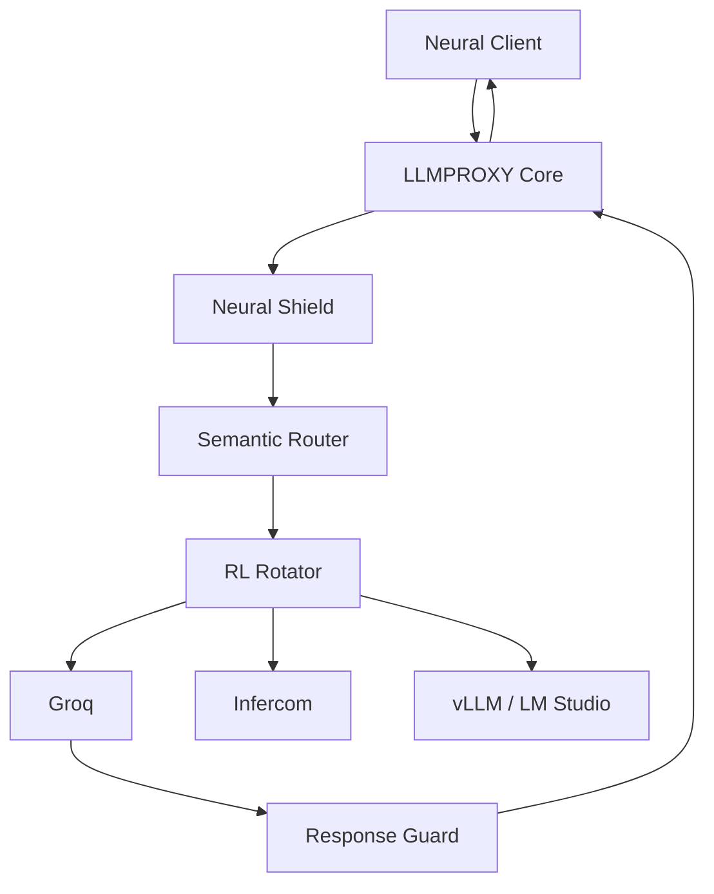

# LLMPROXY

LLMPROXY is a high-performance, asynchronous orchestration layer for Large Language Model (LLM) endpoints. It provides a unified interface for routing, load balancing, and securing neural traffic across multiple remote providers (Groq, Infercom, HuggingFace, etc.) and local inference engines.

## Overview

The system is designed for deterministic control and deep transparency. It implements a multi-agent architecture that autonomously discovers, validates, and rotates endpoints based on real-time latency, success rates, and semantic intent.

## Core Features

### Asynchronous Flow Engine
Built on `FastAPI` and `aiosqlite`, the proxy operates on a non-blocking I/O loop. This architecture eliminates database contention and ensures consistent throughput even under intense concurrent load.

### Neural Shield (Defensive Perimeter)
LLMPROXY implements a dual-sided security protocol:
*   **Inbound Protection**: Payload flooding prevention and prompt injection detection.
*   **Outbound Validation (Language Guard)**: Response inspection for charset anomalies and entropy-based gibberish detection.
*   **Response Injection Guard**: Prevents remote models from leaking system instructions or spoofing conversational turns.

### Intelligence-Aware Routing
*   **Semantic Router**: Classifies incoming requests by complexity to steer traffic toward the most cost-effective or highest-performing node.
*   **RL Rotator**: Uses a Reinforcement Learning (Epsilon-Greedy) approach to dynamically adjust traffic weighting based on endpoint performance tiers.
*   **Priority Steering**: Allows for a manual override of the AI balancer through the management interface.

### Unified SOTA Interface
The system features a premium web-based cockpit with:
*   Real-time terminal log streaming (SSE).
*   Dynamic feature control (Hot-toggling of neural guards).
*   Granular endpoint management (Quick Actions: Toggle, Delete, Priority).
*   Live metrics dashboard for latency and success rate monitoring.

## Architecture



## Setup and Installation

### Prerequisites
*   Python 3.12+
*   Virtual Environment recommended

### Installation
1.  Clone the repository and install dependencies:
    ```bash
    pip install -r requirements.txt
    ```
2.  Configure environment variables in `.env`:
    ```bash
    LLM_PROXY_API_KEYS=["your-internal-keys"]
    GROQ_API_KEY=...
    HF_TOKEN=...
    ```
3.  Launch the system:
    ```bash
    python3 main.py
    ```

## Security Protocol

LLMPROXY treats all remote traffic as untrusted. Every response is sanitized and validated for:
1.  **Semantic Integrity**: No leaking of internal proxy logic.
2.  **Structural Purity**: No non-standard charsets or malformed encoding.
3.  **Link Sanitization**: Malicious domains are automatically redacted.

## Versioning

The project follows Semantic Versioning (SemVer). Version updates are managed via `scripts/bump_version.py` and reflected dynamically in the UI and Backend headers.
